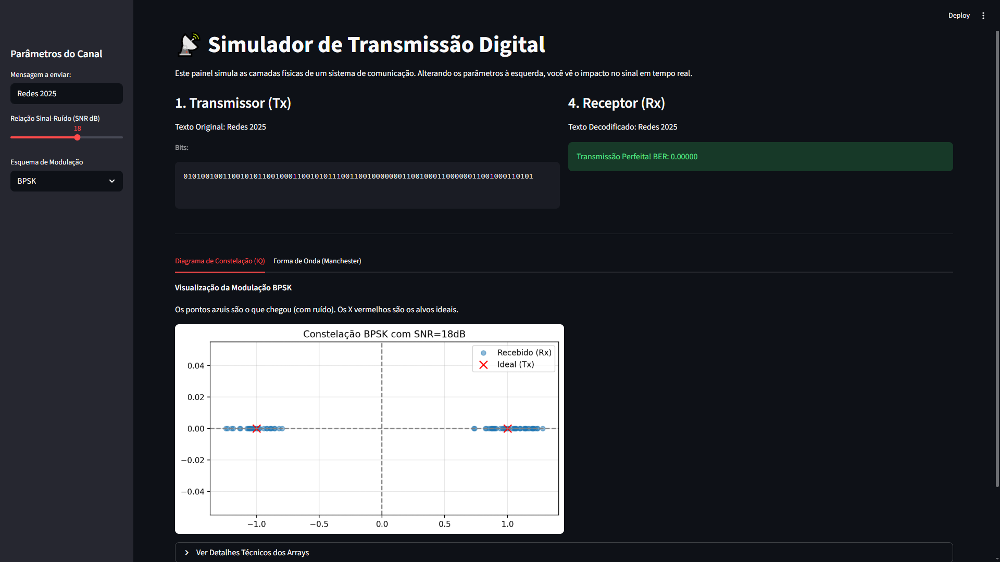
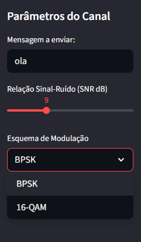
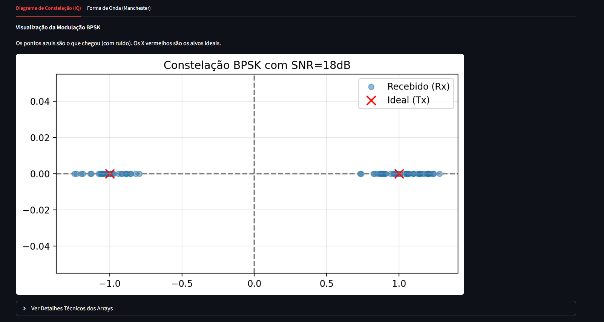
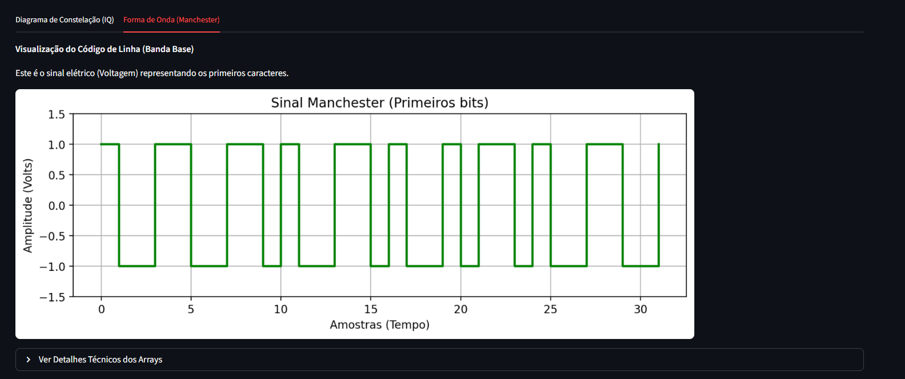

# 📡 Simulação de Sistema de Transmissão Digital

> Projeto acadêmico para a disciplina de Redes de Computadores: Internetworking, Roteamento e Transmissão. Implementação completa da camada física de um sistema de comunicação digital, cobrindo desde a fonte até o receptor, com simulação de ruído e análise.


## Sobre o Projeto

Este projeto visa simular o comportamento de sinais digitais em um canal ruidoso. O sistema divide o problema em duas camadas principais: **Codificação de Linha** (Banda Base) e **Modulação Digital** (Banda Passante), permitindo a análise comparativa entre diferentes técnicas.



O objetivo principal é gerar gráficos de **BER (Bit Error Rate) vs SNR (Signal-to-Noise Ratio)** e visualizar constelações em tempo real.

### Principais Funcionalidades
* **Fonte de Dados:** Conversão de texto ASCII para fluxo de bits.
* **Codificação de Canal:** Implementação do código de linha **Manchester**.
* **Modulação Digital:**
    * **BPSK** (Binary Phase Shift Keying).
    * **16-QAM** (Quadrature Amplitude Modulation).
* **Canal Ruidoso:** Simulação de Ruído Branco Gaussiano Aditivo (**AWGN**).
* **Receptor:** Decodificação baseada em Distância Euclidiana.
* **Interface Gráfica:** Dashboard interativo em **Streamlit** para alterar o SNR em tempo real e visualizar a deformação da constelação.

## 📂 Estrutura do Projeto

O código foi modularizado para facilitar a manutenção e o entendimento:

```text
📁 digital_comm_simulation/
│
├── 📄 app.py              # Interface Interativa (Dashboard Streamlit)
├── 📄 main.py             # Simulação Monte Carlo (Gera o gráfico BER vs SNR)
├── 📄 modulation.py       # Lógica de Modulação/Demodulação (BPSK, 16-QAM)
├── 📄 source_coding.py    # Lógica de Codificação de Linha (Manchester)
├── 📄 utils.py            # Utilitários (Conversão Texto <-> Binário, BER)
├── 📄 requirements.txt    # Dependências do projeto
└── 📄 README.md           # Documentação
```

## Como Executar

### Pré-requisitos
Certifique-se de ter o Python 3.x instalado. Instale as bibliotecas necessárias:

```bash
pip install -r requirements.txt
```
1. Rodando a Simulação Científica (Gráficos)  
   Para gerar as curvas de "waterfall" (BER vs SNR) para o relatório técnico:

```bash
python main.py
```
Isso abrirá uma janela do Matplotlib com o comparativo entre BPSK, 16-QAM e Manchester.

2. Rodando o Dashboard Interativo (Apresentação)  
   Para abrir a interface visual no seu navegador:

```bash
streamlit run app.py
```
Nesta interface, você pode digitar mensagens personalizadas, ajustar o nível de ruído (dB) e ver a constelação se dispersando em tempo real.

## Resultados Esperados
O projeto demonstra conceitos fundamentais da Teoria da Informação:
- Parametrização de canal, com mensagem a enviar, relação sinal-ruído e esquema de modulação (BPSK ou 16-QAM):



- BPSK apresenta maior robustez ao ruído (menor BER com baixo SNR), mas menor eficiência espectral.
- 16-QAM permite transmitir 4 bits por símbolo, mas exige uma relação sinal-ruído (SNR) muito maior para manter a integridade dos dados (os pontos da constelação são mais próximos).

O gráfico gerado comprova a teoria da "curva de erro" baseada na função Q:




## Tecnologias Utilizadas
- Python: Linguagem base.
- NumPy: Manipulação vetorial e geração de ruído gaussiano.
- Matplotlib: Plotagem de gráficos científicos.
- Streamlit: Criação da interface web interativa.

## Autores
- Eduardo Graf
- Nathan Wagner

Este projeto foi desenvolvido para fins educacionais no curso de Ciência da Computação.